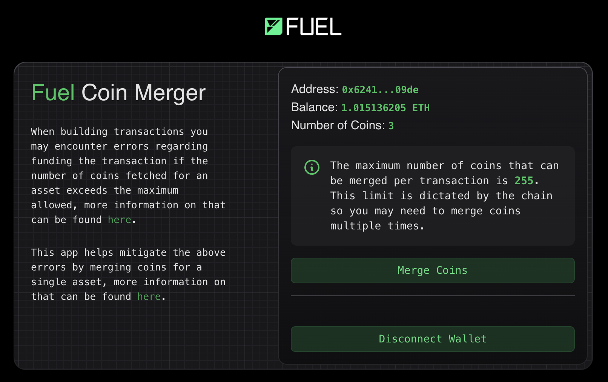

# Fuel Coin Merger



This is a simple app that allows you to merge coins on the Fuel blockchain.

## Getting Started

1. Start the Fuel development server if you want to test on a local chain.

```bash
pnpm fuels:dev
```

2. Start the Next.js development server.

```bash
pnpm dev
```
